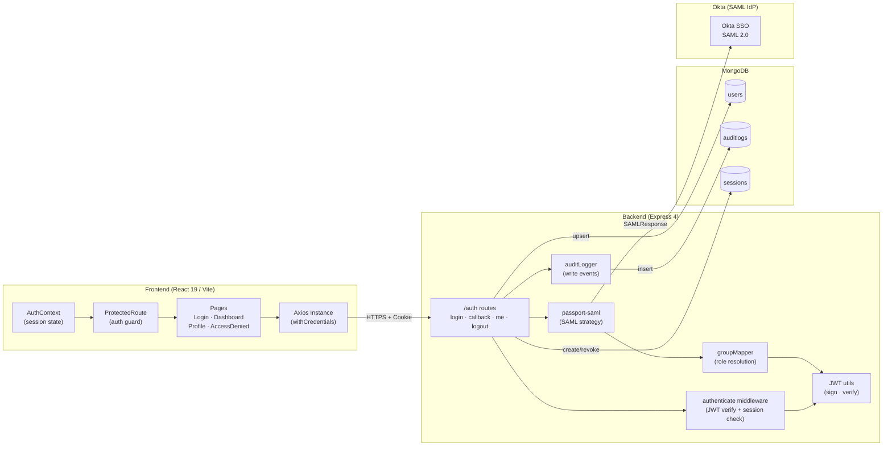
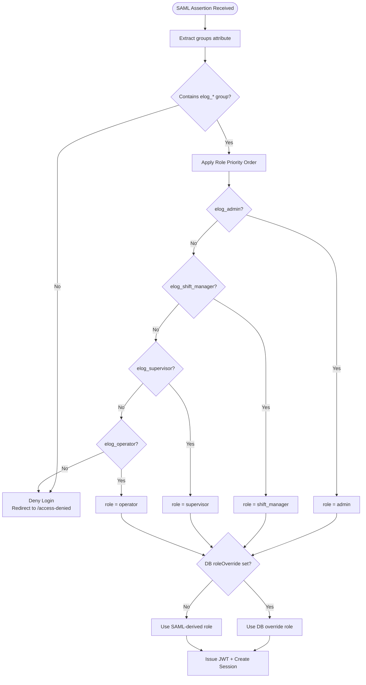

# System Architecture & Group-to-Role Mapping

## System Component Diagram

---

## Group-to-Role Mapping Flow

## AI Image Generation Prompt

> "A software system component architecture diagram for an enterprise SSO application. Left panel: React 19 SPA components — AuthContext, ProtectedRoute, Pages (Login, Dashboard, Profile, AccessDenied), Axios HTTP client. Center panel: Node.js Express API components — auth routes, JWT middleware, passport-saml strategy, group-to-role mapper, audit logger. Right panel: external services — Okta SAML IdP and MongoDB with three collections (users, auditlogs, sessions). Labeled directional arrows connect all components. Bottom: a group-to-role mapping table showing elog_admin→admin, elog_shift_manager→shift_manager, elog_supervisor→supervisor, elog_operator→operator with a priority order indicator. Professional enterprise architecture style, grey and blue palette, clean flat design, white background."
